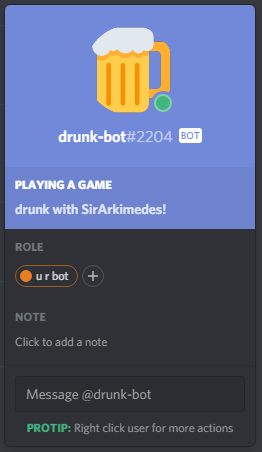
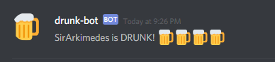

  

# Discord Drunk Bot
* Inform your guild-mates who is drunk or not. :beer:
* Watch laughter ensue! :beers:

# How to run
### Requirement
* Node

### Process
1. Run `npm install`.
2. Create a bot with Discord  [here](https://discordapp.com/developers/applications/me).
3. Invite the newly created bot to a server with this link, replacing CLIENT with your bot's client ID: https://discordapp.com/oauth2/authorize?client_id=CLIENT&scope=bot
3. Copy the bot's token.
4. Create a `auth.json` file in the root folder with the following format:
  ` {
      token: "YOUR BOT TOKEN HERE"
  } `
5. Run `node bot.js`.

# Preview

  

  

# Thanks!
* This project was made for the people that enjoy messing with their friends.
* Thanks for checking it out!

  Made with ❤️ by [@SirArkimedes](https://github.com/SirArkimedes) and [@JonasESmith](https://github.com/JonasESmith).

